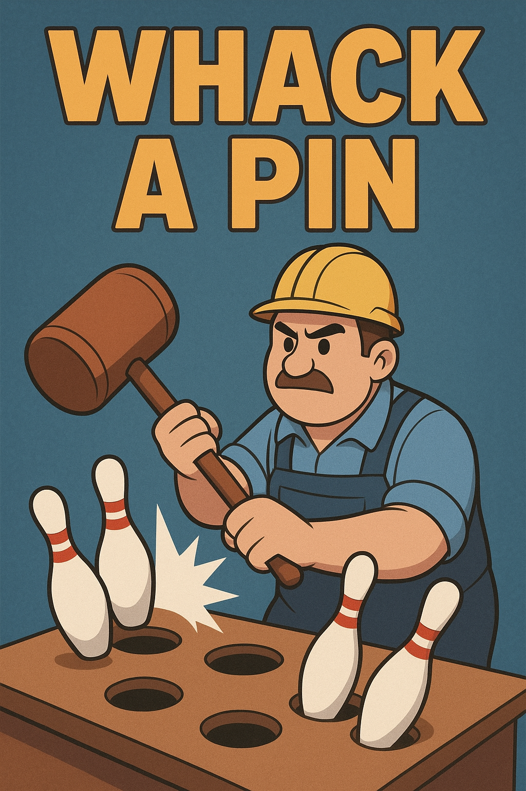

## Context / Purpose

This videogame is a classroom project for the GECEGS **Course in Video Game and Virtual Reality Development** at **CPIFP Alan Turing (Campanillas, Málaga)**.
Its main objective is to apply Unity movile development concepts, including endgame scenes and movile input.

## Story

Whack a Pin is a twist to the famous game "Whack a Mole", this time, you'll play as a Bowling Alley Manager, with little to no expirience in any sort of machinery. When machine that displays the pins starts failing, and displaying the pins randomly, he is told to "Fix it", and he only knows one way... **Whackin those pins until they learn their places!**

## Mechanics

- **Pin Points**: There's two types of pins, the good pins (yellow) taht increases the score, and the bad pins(purple) that decreases it.

## Source Code

This project is developed in **Unity 6** with C#. This are the scripts:

- **AudioManager**: Controls the audio of the game, including the background music and SFX.
- **AudioToggleButtonController**: Mutes or activates the audio of the game.
- **ChooseDifficultyController**: Depending of the difficulty selected by the player, load an scene or another.
- **EndGameManager**: Contains the functions that can be run in the menu, along with the player's score.
- **GameManager**: Manages the gloval logic of the game, levels and pause.
- **GroupPinController**: Controls the logic and timing of the pins mid game.
- **HUDController**: Controls the HUD of the game on the acts of the game.
- **LevelManager**: Controls the functions to access the different levels of the game.
- **PinController**: Increases or decreases the score of the game, depending on the type of pin that was hit.

All the scripts contain internal documentation for further understanding.

## Scoring System

Dependes on the difficulty selected:

## Credits

**Programming and Art**  
Miguel Ángel Ávila Rosas

**Resources**  
- [Pixelfrogsstudio](https://assetstore.unity.com/publishers/44925)
- [Karsiori](https://assetstore.unity.com/publishers/90197)
- [NYKNCK](https://assetstore.unity.com/publishers/38584)

**Music and SFX**  
- Main Soundtrack: AI
- Apple Sound Effect: Josh Mancell

## Play Now

Play on **Itch.io**:  
[Tiki Tuki on Itch.io](https://bruxter.itch.io/whack-a-pin)

## Special Mentions
Thanks to [Alberto Fernandez Idalgo](https://github.com/albertofernandezhid) for the README base of this project!
